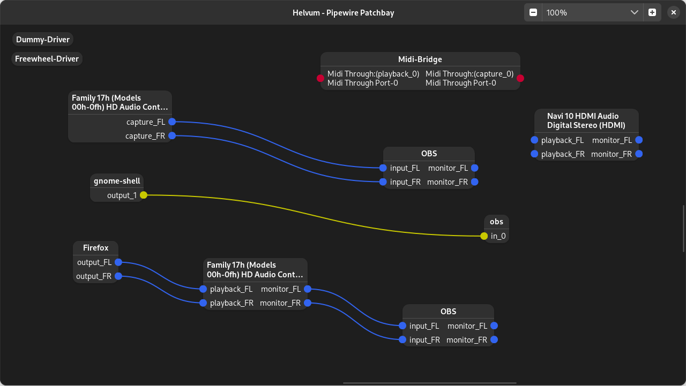

Helvum is a GTK-based patchbay for pipewire, inspired by the JACK tool [catia](https://kx.studio/Applications:Catia).



<a href="https://flathub.org/apps/details/org.pipewire.Helvum"></a>

<a href="https://repology.org/project/helvum/versions"></a>

# Features planned

- Volume control
- "Debug mode" that lets you view advanced information for nodes and ports

More suggestions are welcome!

# Building

## Via flatpak

If you don't have the flathub repo in your remote-list for flatpak you will need to add that first:

```shell
$ flatpak remote-add --if-not-exists flathub https://flathub.org/repo/flathub.flatpakrepo
```

Then install the required flatpak platform and SDK, if you dont have them already:

```shell
$ flatpak install org.gnome.{Platform,Sdk}//50 org.freedesktop.Sdk.Extension.rust-stable//25.08 org.freedesktop.Sdk.Extension.llvm22//25.08
```

To compile and install as a flatpak, clone the project, change to the project directory, and run:

```shell
$ flatpak-builder --install flatpak-build/ build-aux/org.pipewire.Helvum.json
```

You can then run the app via

```shell
$ flatpak run org.pipewire.Helvum
```

## Manually

- **Meson** (>= 1.9.0)
- **Rust Toolchain** (>= 1.94.0)
- **Clang/LLVM** (required for `bindgen` to generate PipeWire bindings)
- **GTK4** (>= 4.22.0) development packages
- **libadwaita-1** (>= 1.9.0) development packages
- **libpipewire-0.3** (>= 1.6.0) development packages and their dependencies

### Distribution-specific dependencies

| Distribution | Required Packages | Environment Variables |
| :--- | :--- | :--- |
| **Arch Linux** | `meson`, `rust`, `clang`, `gtk4`, `libadwaita`, `pipewire` | `LIBCLANG_PATH=/usr/lib` |
| **Fedora** | `meson`, `rust`, `cargo`, `clang-devel`, `gtk4-devel`, `libadwaita-devel`, `pipewire-devel` | `LIBCLANG_PATH=/usr/lib64` |
| **OpenSUSE** | `meson`, `rust`, `cargo`, `clang-devel`, `gtk4-devel`, `libadwaita-devel`, `pipewire-devel` | `LIBCLANG_PATH=/usr/lib64` |
| **Debian/Ubuntu** | `meson`, `rustc`, `cargo`, `libclang-dev`, `libgtk-4-dev`, `libadwaita-1-dev`, `libpipewire-0.3-dev` | `LIBCLANG_PATH=/usr/lib/llvm-21/lib` (path may vary by LLVM version) |
| **Alpine** | `meson`, `rust`, `cargo`, `clang-dev`, `clang-libclang`, `gtk4.0-dev`, `libadwaita-dev`, `pipewire-dev` | `LIBCLANG_PATH=/usr/lib` |

To compile and install, run

```shell
$ meson setup build && cd build
$ meson compile
$ meson install
```

in the repository root.
This will install the compiled project files into `/usr/local`.

# License and Credits

Helvum is distributed under the terms of the GPL3 license.
See LICENSE for more information.

Parts of the build system were taken from the [gtk-rust-template](https://gitlab.gnome.org/World/Rust/gtk-rust-template) project,
which is provided under the terms of the [MIT license](https://gitlab.gnome.org/World/Rust/gtk-rust-template/-/blob/master/LICENSE.md).
